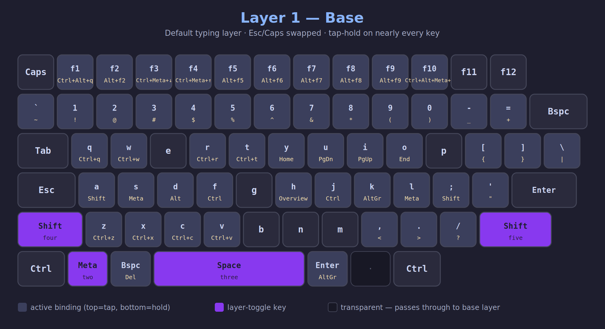
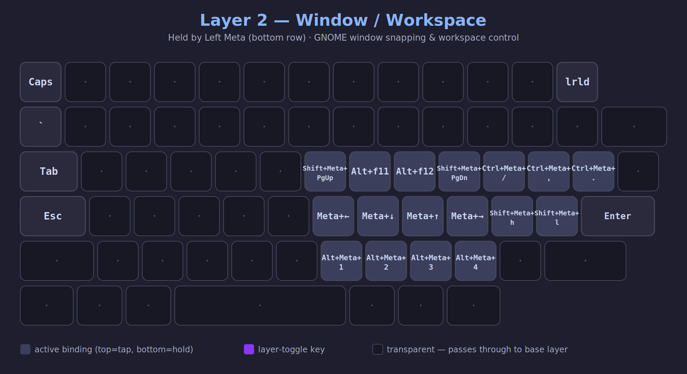
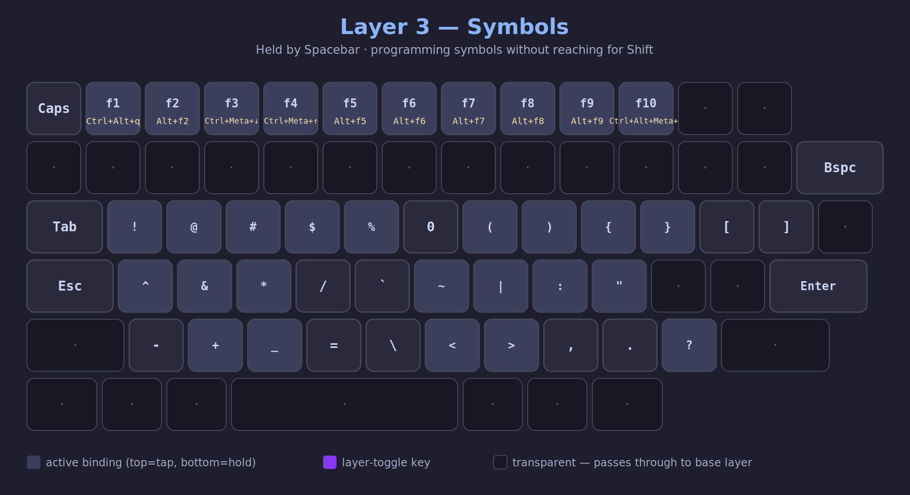
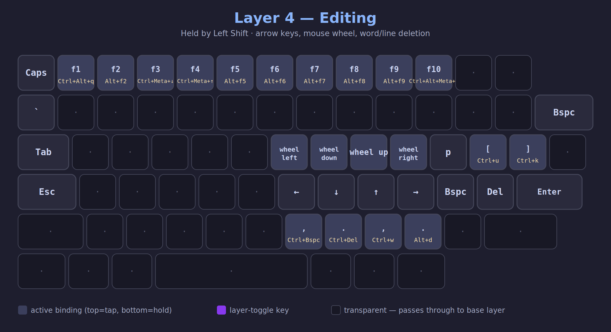
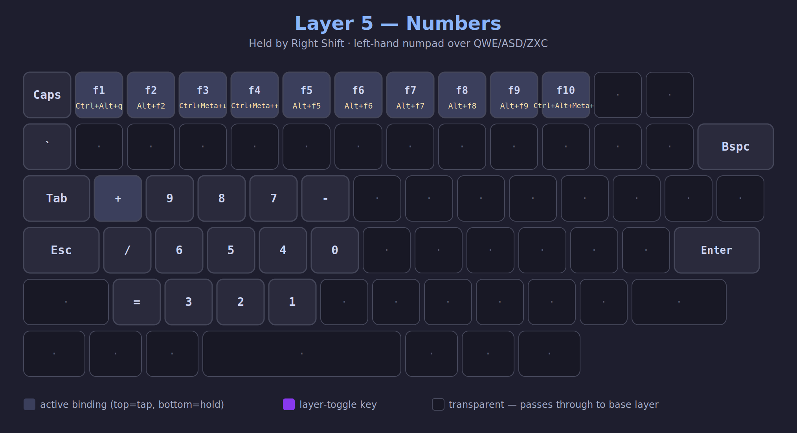

<div align="center">

# ⌨️ keyhack-kanata

**A 5-layer [Kanata](https://github.com/jtroo/kanata) keyboard configuration for GNOME**


</div>

---

## Overview

This configuration turns a standard laptop keyboard into a five-layer, tap-hold-driven control surface. Almost every key does two jobs — a quick **tap** for its normal character, and a **hold** for a modifier, shortcut, or entire layer switch.

Esc and Caps Lock are swapped on **every** layer.

| Layer | Held by | Purpose |
|---|---|---|
| **1 — Base** | *(default)* | Normal typing with tap-hold modifiers and shortcuts on nearly every key |
| **2 — Window / Workspace** | Left Meta (bottom row) | GNOME window snapping, display switching, workspace navigation, kitty tab controls |
| **3 — Symbols** | Spacebar | Programming symbols without reaching for Shift |
| **4 — Editing** | Left Shift | Arrow keys, mouse-wheel emulation, word/line deletion |
| **5 — Numbers** | Right Shift | Left-hand numpad over QWE / ASD / ZXC |

> **Note:** Left Shift and Right Shift were freed up to become layer-toggle keys. Their modifier function still exists — hold **A** for Left Shift, hold **;** for Right Shift. The S key holds Left Meta so the physical Left Meta key can be repurposed for Layer 2.

---

## 📚 Layer Reference

### Layer 1 — Base



Default typing layer. Home row modifiers: **S**=Left Meta, **D**=Left Alt, **F**=Left Ctrl, **H**=Shift+` (GNOME Activities overview), **J**=Right Ctrl, **K**=Right Alt, **L**=Right Meta. Number row is tap-hold: tap digit, hold shifted symbol. F-row system shortcuts: **F1**=quake terminal (Ctrl+Alt+Q), **F2**=run command (Alt+F2), **F3/F4**=brightness down/up (Ctrl+Meta+↓/↑), **F5**=mute (Alt+F5), **F6**=volume down (Alt+F6), **F7**=volume up (Alt+F7), **F8**=microphone (Alt+F8), **F9**=screenshot (Alt+F9), **F10**=lock screen (Ctrl+Alt+Meta+L). Top row: **Q/W/R/T**=Ctrl+Q/W/R/T, **Y/U/I/O**=Home/PgDn/PgUp/End. Brackets: **[**={, **]**=}, **\\**=|. Bottom row: **Z/X/C/V**=Ctrl+Z/X/C/V, **,/.//**=< > ?. Thumb keys: **Left Meta** (bottom row)=Layer 2, **Spacebar**=Layer 3, **Left Shift**=Layer 4, **Right Shift**=Layer 5. **Backspace** tap=backspace/hold=delete. **Enter** tap=enter/hold=Right Alt.

### Layer 2 — Window / Workspace



Held by the physical **Left Meta** key (bottom row). Right-hand keys drive GNOME window management and workspace navigation. **Y**=Shift+Meta+PgUp (move window to previous display), **O**=Shift+Meta+PgDn (move window to next display). **U**=Alt+F11 (workspace on the left), **I**=Alt+F12 (workspace on the right). **H/J/K/L**=Meta+Left/Down/Up/Right (GNOME workspace navigation). **N/M/,/.**=Alt+Meta+1/2/3/4 (switch directly to workspaces 1–4). **P**=close kitty tab (Ctrl+Meta+/), **[**=previous tab (Ctrl+Meta+,), **]**=next tab (Ctrl+Meta+.). **;/**=Shift+Meta+H/L (kitty scroll left/right). **F12** position reloads kanata config (`lrld`).

### Layer 3 — Symbols



Held by **Spacebar**. Programming symbols laid over the letter keys so brackets, pipes, and shifted characters are reachable without contorting for Shift. Top row: **Q/W/E/R/T**=! @ # $ %, **Y**=0, **U/I**=( ), **O/P**={ }. Home row: **A/S/D**=^ & *, **F**=/, **G**=` , **H**=~, **J**=|, **K**=:, **L**=\". Bottom row: **Z/X/C/V**=- + _ =, **B**=\\, **N/M**=< >, **,/.//**=, . ?. The F-row system shortcuts from Layer 1 stay active.

### Layer 4 — Editing



Held by **Left Shift**. **H/J/K/L** become arrow keys (← ↓ ↑ →). **Y/U/I/O** become mouse-wheel left/down/up/right. **[**=Ctrl+U (delete to beginning of line), **]**=Ctrl+K (delete to end of line). Bottom row: **N**=Ctrl+Backspace (delete word backward), **M**=Ctrl+Delete (delete word forward), **,**=Ctrl+W (delete word backward, terminal style), **.**=Alt+D (delete word forward). The F-row system shortcuts from Layer 1 stay active.

### Layer 5 — Numbers



Held by **Right Shift**. A left-hand numpad: top row **Q/W/E/R/T**=+ 9 8 7 -, home row **A/S/D/F/G**=/ 6 5 4 0, bottom row **Z/X/C/V**== 3 2 1. The F-row system shortcuts from Layer 1 stay active.

---

## 🎨 Customization

### Tap-hold timing

Both timings default to **200 ms**. If you're seeing accidental holds or missed taps, adjust in `defvar`:

```lisp
(defvar
  tap-time 250
  hold-time 250
)
```

### Layer-toggle keys

| Key | Tap | Hold |
|---|---|---|
| Left Meta (bottom row) | Left Meta | → **Layer 2** |
| Spacebar | Space | → **Layer 3** |
| Left Shift | Left Shift | → **Layer 4** |
| Right Shift | Right Shift | → **Layer 5** |

### Home-row modifiers

| Key | Tap | Hold |
|---|---|---|
| A | a | Left Shift |
| S | s | Left Meta |
| D | d | Left Alt |
| F | f | Left Ctrl |
| H | h | Shift+` (GNOME Activities) |
| J | j | Right Ctrl |
| K | k | Right Alt |
| L | l | Right Meta |
| ; | ; | Right Shift |
| ' | ' | " |

---

## 🔧 Troubleshooting

**Kanata won't start**

```bash
groups $USER | grep uinput   # confirm group membership; re-login or `newgrp uinput` if missing
ls -la /dev/uinput            # should show crw-rw---- 1 root uinput
```

**Service fails to start**

```bash
journalctl --user -u kanata.service -f
kanata --cfg ~/.config/kanata/kanata_gnome.kbd --debug
```

**Keys not responding**

```bash
ps aux | grep kanata
pkill kanata && kanata --cfg ~/.config/kanata/kanata_gnome.kbd
```

---

## 📖 Resources

- [Kanata](https://github.com/jtroo/kanata) — official repository
- [Kanata configuration guide](https://github.com/jtroo/kanata/blob/main/docs/config.adoc)
- [Kanata simulator](https://jtroo.github.io/) — test configs in-browser

---

## 📄 License

MIT License — see [LICENSE](LICENSE)

<div align="center">

**Maintained by** [@stefan-hacks](https://github.com/stefan-hacks)

</div>
